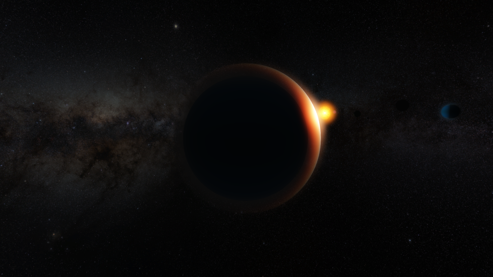
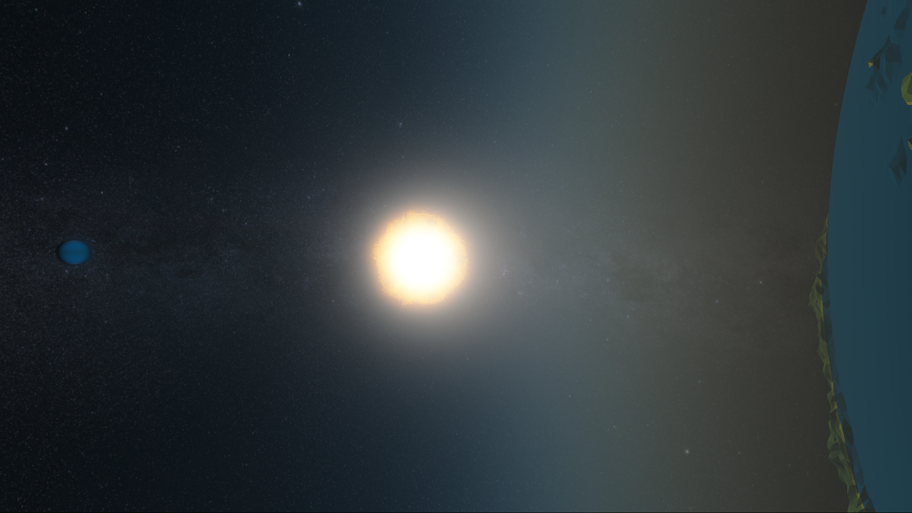
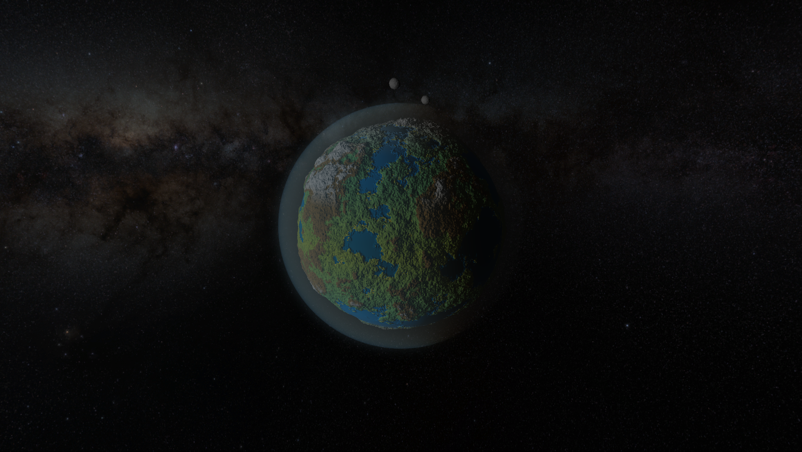
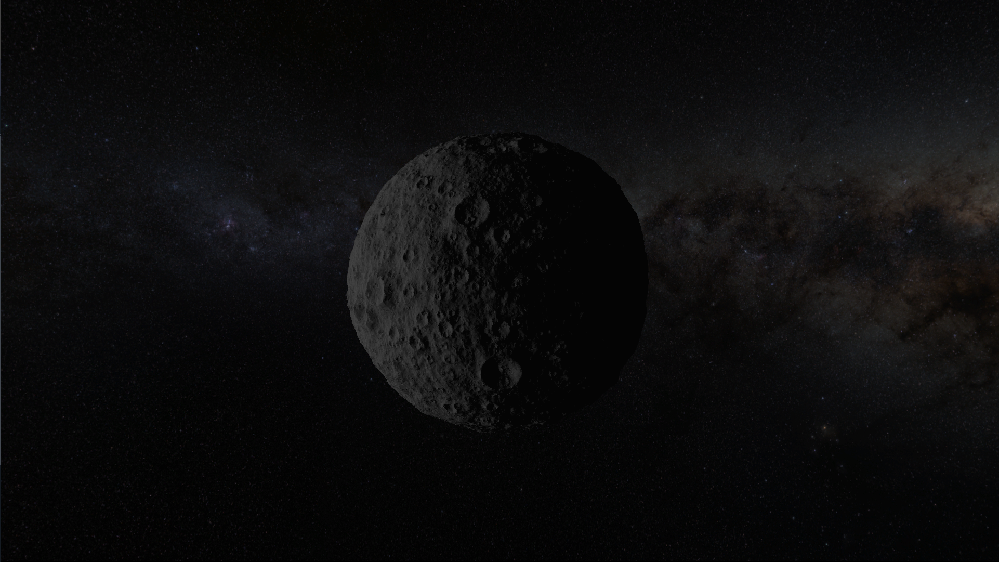
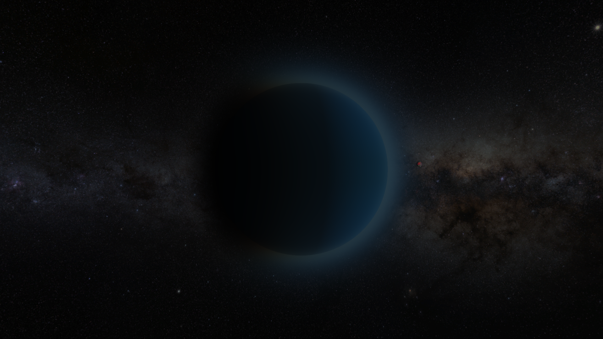
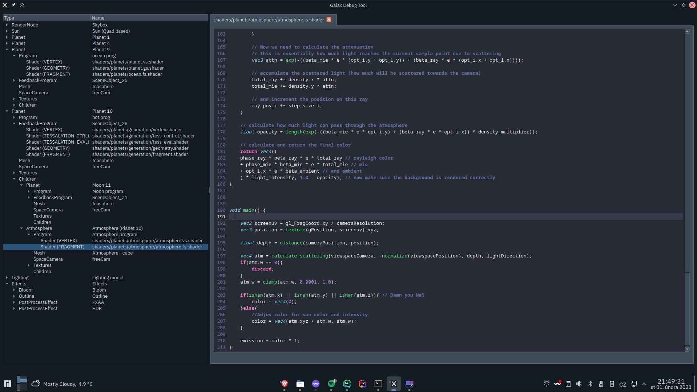
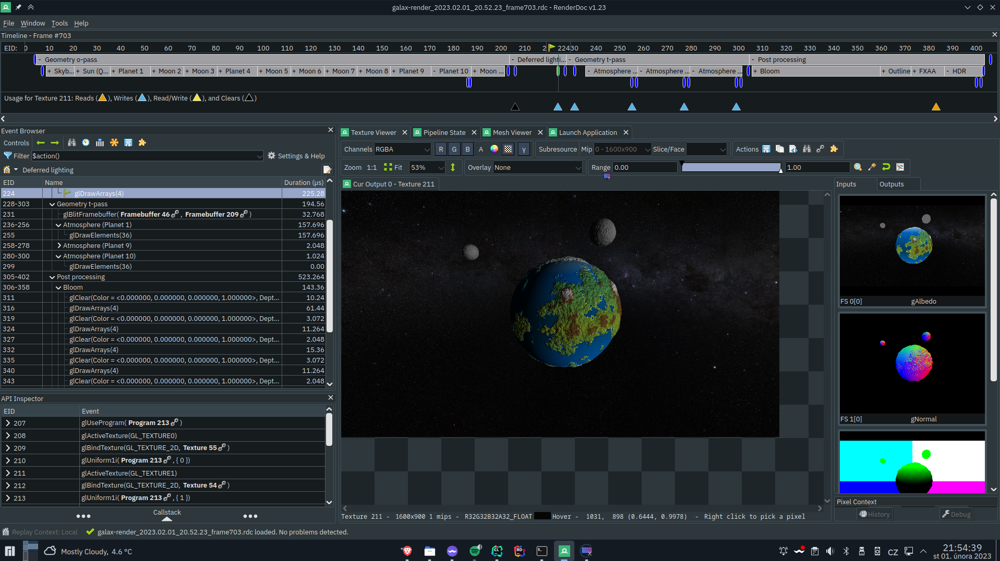

# galax-renderer

A deferred OpenGL renderer (with basic transparency support) that was written with the goal of being as extensible as possible and being as easy to use as possible while still offering basic functionality out of the box.
This repo also contains a "showcase" application which renders a proceduraly genreated solar system with couple of planets, moons and a star and couple of post process efects such as FXAA, Bloom and tone mapping.

## Features
- Good performance out of the box (the test applications runs above 60FPS even on Vega 6)
- Extensibility
- Runtime debug options
- Detailed RenderDoc output when build in Debug mode (see screenshots below)
- Demo simluates atmosphere using both Reyleigh and Mie scattering
- Demo is also using performance tricks such as feedback buffers (should be changed to compute shaders) to improve performance even further

## Building
Build was only tested on Manjaro Linux (other distros *should* be fine). You will need to have `conan` setup to have a successful build.

Build steps:
```
git clone https://github.com/Kaharonus/galax-renderer.git
cd galax-renderer
mkdir build && cd build
conan install .. --build=missing
cmake .. && cmake --build .
```
Binary should now be ready under `build/src/bin`

## Running
You can run with or without `--with-debug` argument. When run with the argument a debug window will open where you should be able to edit shaders on runtime, look at the textures, check all the settings (and types) etc.

### Controls
```
WASD - movement
Mouse click + drag - spinning around
Clicking on a planet - shows a detailed view of the planet (clicking away stops this)
p - pause/resume orbit
Shift (hold) - faster movement
Ctrl (hold) - slower movement
F11 (when running without debug) - go fullscreen
```

### Screenshots
Couple more are available in the `screenshots` directory
















